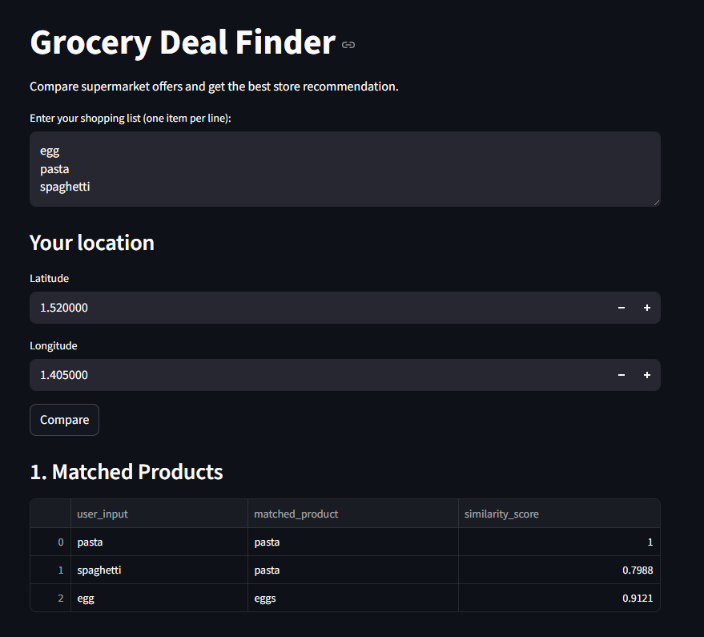
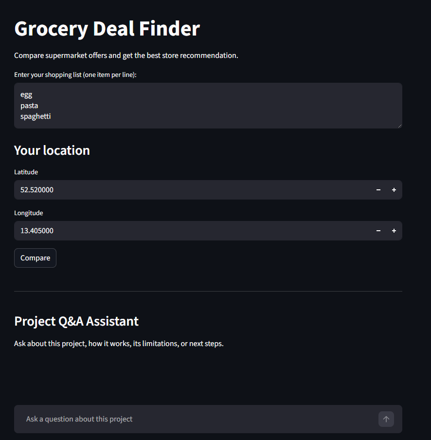
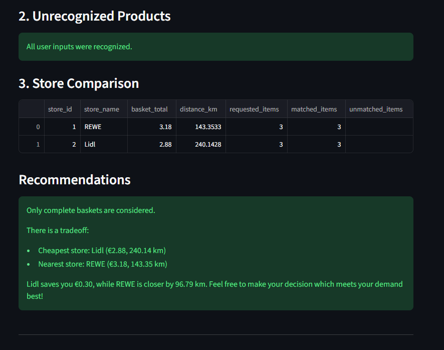
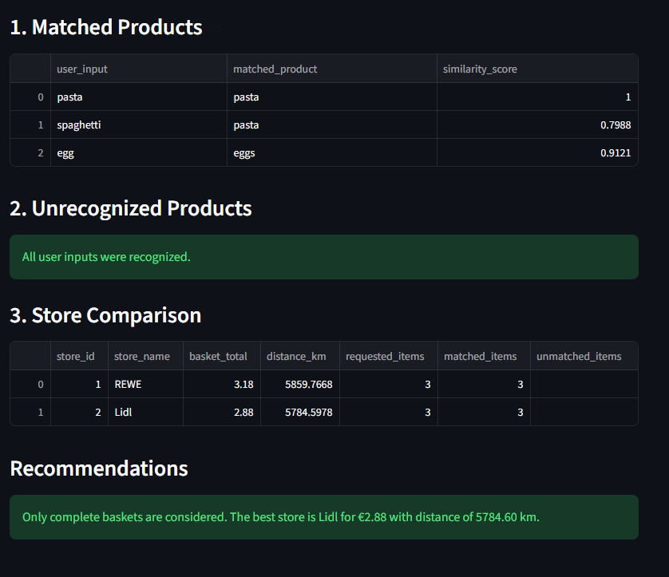
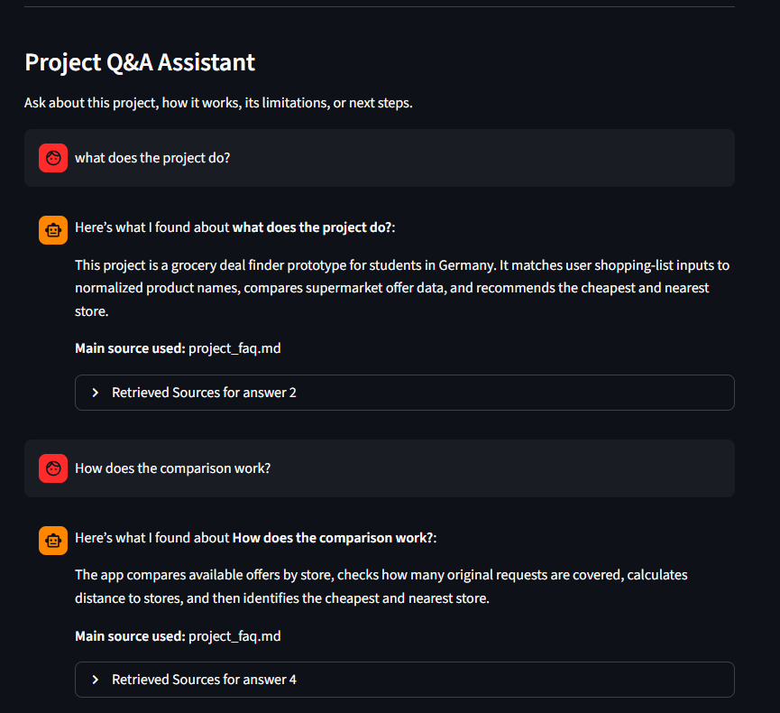

# Grocery Deal Finder

An AI-assisted prototype that helps students or budget-conscious consumers in Germany compare supermarket offers and find the best nearby store based on price and distance.

## Problem
Buyers often need to check multiple supermarket flyers and apps to find the best discounts. This takes time and makes it harder to save money.

## Project Goal
Build a simple app that:
- compares grocery offers across supermarkets
- ranks stores by basket price
- considers distance to stores
- recommends the best shopping option

## MVP Scope
- 1 city in Germany
- 2 supermarkets
- 20–30 products
- simple shopping list comparison
- location-based recommendation
- basic AI/NLP product matching - semantic product matching using a pretrained Sentence Transformer (SBERT-style) model

## Planned Tech Stack
- Python
- pandas
- numpy
- pytorch/tensorflow
- Streamlit
- sentence-transformer
- geopy

## Project Status
This project is currently a working prototype.

### Example Workflow
1. User enters a shopping list
2. The NLP matcher maps each input to a normalized product
3. The app compares available offers across stores
4. The app checks whether each store covers the requested basket
5. The app shows the cheapest store, nearest store, and missing-item information

### Known Limitation
- Uses sample/manual data instead of a live supermarket data pipeline
- Covers only a small set of products and stores
- Quantity-aware basket compasison is not fully implemented yet
- Recommandation logic is still being refined

### Next Steps
- Improve test coverage for edge cases
- Add quantity-aware basket comparison
- Expand store and product data
- Improve UI presentation and recommendation messaging
- Explore semi-automated or automated data ingestion
  
## Roadmap
See `roadmap.md`

## Weekly Progress
See `weekly_checklist.md`

## Screenshots
### Homepage
 

### Grocery Comparison
 

### Project Q&A Assistant

